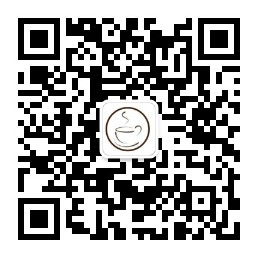

哈喽， 我是**渡码**，分享 ChatGPT、AI干货。

**公众号回复key获取免费共享的chatgpt api key国内直接用，免魔法**

**AI知识库** 地址: https://waytoagi.feishu.cn/wiki/QPe5w5g7UisbEkkow8XcDmOpn8e

我在短视频分享的项目大都是开源的，你可以直接下载运行，会用 Python 即可，安装运行非常简单。

如果你不会编程或者运行过程中出现问题，可以关注公众号**渡码**向我提问。AI相关项目、优秀资料都会在公众号首发。

最新开发的项目是 PDF 翻译助手！

之前开发的 ChatGPT 趣味项目：

* 🔥 [AI论文助手](https://github.com/duma-repo/academi-kit)
* 🔥 [AI算法助手](https://github.com/duma-repo/chat-algo)
* 🔥 [AI阅读项目助手](https://github.com/duma-repo/ai_code_reader)

